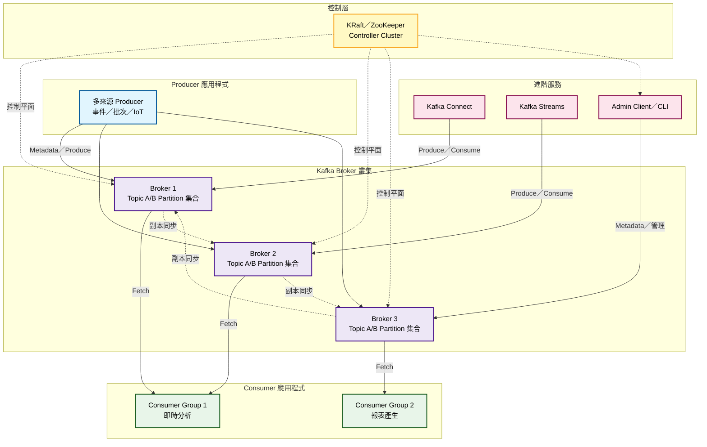

# Kafka 系統整體架構圖

## 概述
此圖展示 Apache Kafka 的整體系統架構，包括核心組件及其相互關係。

## Mermaid 圖表

## 架構說明

### 核心組件

1. **Producer (生產者)**
   - 負責將訊息發送到 Kafka Topics
   - 可以選擇發送到特定 Partition 或由 Kafka 自動分配
   - 支援批次發送以提高效能

2. **Kafka Broker (代理伺服器)**
   - Kafka 叢集的核心節點
   - 負責儲存和管理 Topics 的 Partitions
   - 處理 Producer 和 Consumer 的請求

3. **Consumer (消費者)**
   - 從 Kafka Topics 讀取訊息
   - 可組成 Consumer Groups 實現負載平衡
   - 支援多種消費模式 (最新、最早、特定偏移量)

4. **Topics & Partitions**
   - Topic: 訊息的邏輯分類
   - Partition: Topic 的物理分割，提供並行處理能力
   - 每個 Partition 有一個 Leader 和多個 Follower 副本

5. **ZooKeeper (傳統模式)**
   - 管理 Kafka 叢集的元數據
   - 協調 Broker 之間的通訊
   - 新版本可使用 KRaft 模式替代

### 關鍵特性

- **分散式**: 資料分布在多個 Broker 上
- **容錯性**: 透過副本機制保證資料安全
- **可擴展性**: 可動態增加 Broker 和 Partition
- **高效能**: 支援高吞吐量的訊息處理

### 資料流向

1. Producer 將訊息發送到指定 Topic 的 Partition
2. Broker 接收並儲存訊息，同步到副本
3. Consumer 從 Partition 讀取訊息進行處理
4. Consumer Group 內的 Consumer 分攤 Partition 的消費工作
