# Kafka 模組依賴關係圖

## 概述
此圖展示 Apache Kafka 專案中各個模組之間的依賴關係，幫助理解代碼組織結構。

## Mermaid 圖表

```mermaid
graph TD
    %% 定義樣式
    classDef core fill:#ffcdd2,stroke:#d32f2f,stroke-width:2px,color:#000
    classDef client fill:#c8e6c9,stroke:#388e3c,stroke-width:2px,color:#000
    classDef server fill:#bbdefb,stroke:#1976d2,stroke-width:2px,color:#000
    classDef streams fill:#f8bbd9,stroke:#c2185b,stroke-width:2px,color:#000
    classDef connect fill:#dcedc8,stroke:#689f38,stroke-width:2px,color:#000
    classDef tools fill:#fff3e0,stroke:#f57c00,stroke-width:2px,color:#000
    classDef test fill:#f3e5f5,stroke:#7b1fa2,stroke-width:2px,color:#000

    %% 核心模組
    subgraph "核心模組"
        CORE[core<br/>伺服器核心邏輯]:::core
        CLIENTS[clients<br/>客戶端 API]:::client
        METADATA_APP[metadata<br/>元數據管理]:::server
        CONTROLLER[controller<br/>控制平面邏輯]:::server
        STORAGE[storage<br/>儲存層抽象]:::server
        RAFT[raft<br/>RAFT 共識實作]:::server
    end

    %% 伺服器模組
    subgraph "伺服器模組"
        SERVER[server<br/>Kafka Broker 主要邏輯]:::server
        SERVER_COMMON[server-common<br/>伺服器通用套件]:::server
        COORDINATOR_COMMON[coordinator-common<br/>協調器通用元件]:::server
        GROUP_COORDINATOR[group-coordinator<br/>消費者群組協調器]:::server
        SHARE_COORDINATOR[share-coordinator<br/>共享消費協調器]:::server
        TRANSACTION_COORDINATOR[transaction-coordinator<br/>交易協調器]:::server
    end

    %% Streams 模組
    subgraph "Streams 生態系統"
        STREAMS[streams<br/>Kafka Streams 核心]:::streams
        STREAMS_SCALA[streams-scala<br/>Scala DSL]:::streams
        STREAMS_EXAMPLES[streams:examples<br/>範例程式]:::streams
        STREAMS_TEST_UTILS[streams:test-utils<br/>測試工具]:::streams
        STREAMS_INTEGRATION[streams:integration-tests<br/>整合測試]:::streams
    end

    %% Connect 模組
    subgraph "Connect 生態系統"
        CONNECT_API[connect:api]:::connect
        CONNECT_RUNTIME[connect:runtime]:::connect
        CONNECT_JSON[connect:json]:::connect
        CONNECT_FILE[connect:file]:::connect
        CONNECT_MIRROR[connect:mirror]:::connect
        CONNECT_TRANSFORMS[connect:transforms]:::connect
        CONNECT_BASIC_AUTH[connect:basic-auth-extension]:::connect
        CONNECT_TEST_PLUGINS[connect:test-plugins]:::connect
    end

    %% 工具模組
    subgraph "工具與管理"
        TOOLS[tools]:::tools
        TOOLS_API[tools:tools-api]:::tools
        SHELL[shell]:::tools
        TROGDOR[trogdor]:::tools
        GENERATOR[generator]:::tools
        EXAMPLES[examples]:::tools
    end

    %% 測試模組
    subgraph "測試支援"
        TEST_COMMON[test-common]:::test
        TEST_UTIL[test-common:test-common-util]:::test
        TEST_RUNTIME[test-common:test-common-runtime]:::test
        TEST_API[test-common:test-common-internal-api]:::test
    end

    %% 依賴關係 - 核心依賴
    SERVER --> CORE
    SERVER --> SERVER_COMMON
    SERVER --> METADATA_APP
    SERVER --> CONTROLLER
    SERVER --> STORAGE
    SERVER --> RAFT

    CORE --> CLIENTS
    CORE --> METADATA_APP
    CORE --> STORAGE
    CORE --> CONTROLLER
    CORE --> RAFT
    CORE --> SERVER_COMMON

    CONTROLLER --> METADATA_APP
    CONTROLLER --> STORAGE
    METADATA_APP --> STORAGE
    RAFT --> STORAGE

    CLIENTS --> CORE
    CLIENTS --> METADATA_APP

    %% 協調器依賴
    GROUP_COORDINATOR --> COORDINATOR_COMMON
    SHARE_COORDINATOR --> COORDINATOR_COMMON
    TRANSACTION_COORDINATOR --> COORDINATOR_COMMON
    COORDINATOR_COMMON --> SERVER_COMMON
    COORDINATOR_COMMON --> METADATA_APP
    COORDINATOR_COMMON --> STORAGE
    SERVER --> GROUP_COORDINATOR
    SERVER --> SHARE_COORDINATOR
    SERVER --> TRANSACTION_COORDINATOR

    %% Streams 依賴
    STREAMS --> CLIENTS
    STREAMS --> STORAGE
    STREAMS_SCALA --> STREAMS
    STREAMS_EXAMPLES --> STREAMS
    STREAMS_TEST_UTILS --> STREAMS
    STREAMS_INTEGRATION --> STREAMS
    STREAMS_INTEGRATION --> STREAMS_TEST_UTILS

    %% Connect 依賴
    CONNECT_RUNTIME --> CONNECT_API
    CONNECT_JSON --> CONNECT_API
    CONNECT_FILE --> CONNECT_API
    CONNECT_MIRROR --> CONNECT_API
    CONNECT_TRANSFORMS --> CONNECT_API
    CONNECT_BASIC_AUTH --> CONNECT_API
    CONNECT_TEST_PLUGINS --> CONNECT_API
    CONNECT_RUNTIME --> CLIENTS
    CONNECT_RUNTIME --> STORAGE
    CONNECT_API --> CLIENTS

    %% 工具依賴
    TOOLS --> TOOLS_API
    TOOLS --> CLIENTS
    TOOLS --> CORE
    SHELL --> CLIENTS
    TROGDOR --> CLIENTS
    EXAMPLES --> CLIENTS
    GENERATOR --> METADATA_APP

    %% 測試依賴
    TEST_COMMON --> TEST_UTIL
    TEST_COMMON --> TEST_RUNTIME
    TEST_COMMON --> TEST_API
    TEST_RUNTIME --> TEST_UTIL
    TEST_RUNTIME --> STORAGE
    TEST_API --> TEST_UTIL
```

## 模組說明

### 核心模組層
- **clients**: 提供 Producer、Consumer API
- **core**: Kafka 的核心業務邏輯 (Scala)
- **metadata**: 管理叢集元數據
- **storage**: 儲存層抽象和實作
- **raft**: Raft 共識算法實作

### 伺服器層
- **server**: Kafka Broker 主要邏輯
- **server-common**: 伺服器通用組件
- **coordinator-common**: 協調器基礎框架
- **group-coordinator**: 消費者群組協調
- **share-coordinator**: 共享消費協調
- **transaction-coordinator**: 交易協調

### 應用層
- **streams**: 流處理框架
- **connect**: 資料整合框架
- **tools**: 管理和監控工具

### 支援層
- **test-common**: 測試基礎設施
- **examples**: 範例和示範程式
- **generator**: 代碼自動生成工具

## 依賴特點

1. **分層架構**: 清晰的分層依賴關係
2. **模組化設計**: 每個模組職責單一
3. **可擴展性**: 新功能可以獨立模組形式添加
4. **測試支援**: 完整的測試基礎設施
