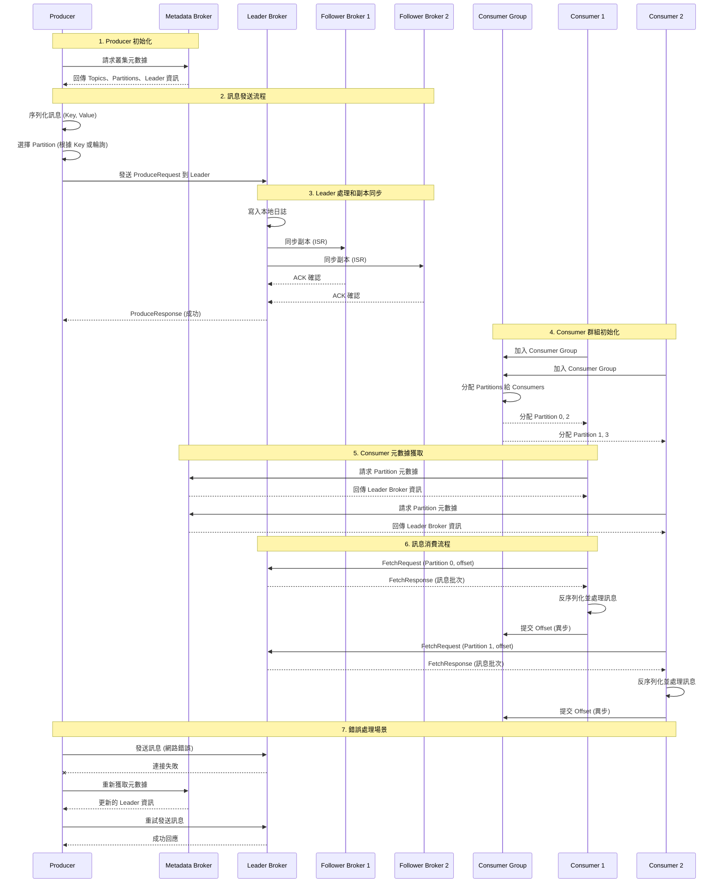

# Kafka 資料流程圖

## 概述
此圖展示資料在 Kafka 系統中的完整流動路徑，從 Producer 發送到 Consumer 接收的整個過程。

## Mermaid 圖表

## 詳細流程說明

### 階段 1: Producer 初始化
1. **元數據獲取**: Producer 連接任一 Broker 獲取叢集元數據
2. **分區策略**: 根據 Key 或配置的分區器選擇目標 Partition
3. **序列化**: 將 Key 和 Value 序列化為位元組陣列

### 階段 2: 訊息發送
1. **批次處理**: Producer 將訊息加入批次緩衝區
2. **壓縮**: 可選的訊息壓縮 (gzip, snappy, lz4, zstd)
3. **網路傳輸**: 發送 ProduceRequest 到 Partition Leader

### 階段 3: Broker 處理
1. **Leader 寫入**: Leader Broker 將訊息寫入本地日誌
2. **副本同步**: 同步到 ISR (In-Sync Replicas) 中的 Follower
3. **確認回應**: 根據 `acks` 配置決定何時回應成功

### 階段 4: Consumer 群組協調
1. **群組加入**: Consumer 加入指定的 Consumer Group
2. **分區分配**: 群組協調器分配 Partitions 給各個 Consumer
3. **重平衡**: 當 Consumer 加入/離開時觸發重平衡

### 階段 5: 訊息消費
1. **拉取請求**: Consumer 主動向 Leader 發送 FetchRequest
2. **批次讀取**: 一次性讀取多個訊息以提高效率
3. **偏移量管理**: 追蹤和提交消費進度

## 關鍵特性

### 可靠性保證
- **至少一次**: 預設的訊息傳遞語義
- **恰好一次**: 透過冪等性和交易實現
- **副本機制**: 透過多副本保證資料持久性

### 效能優化
- **批次處理**: Producer 和 Consumer 都支援批次操作
- **零拷貝**: 使用 sendfile() 系統調用優化網路傳輸
- **壓縮**: 減少網路頻寬和儲存空間使用

### 容錯機制
- **自動重試**: Producer 和 Consumer 的自動重試機制
- **故障轉移**: Leader 故障時自動選舉新 Leader
- **元數據更新**: 動態更新叢集拓撲變化
