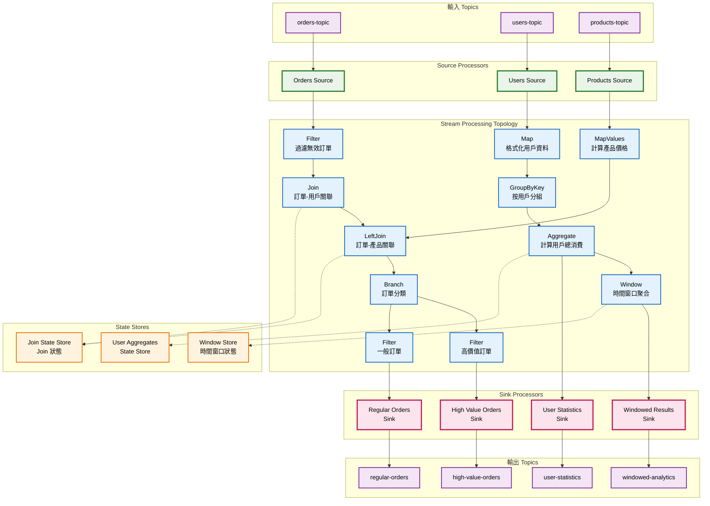
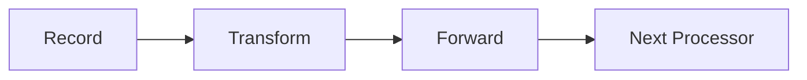

# Kafka Streams 處理拓撲圖

## 概述
此圖展示 Kafka Streams 的處理拓撲結構，包括 Source、Processor、Sink 節點及其連接關係。

## Mermaid 圖表

## 拓撲組件說明

### Source Processors (源處理器)
- **功能**: 從 Kafka Topics 讀取資料流
- **特點**: 
  - 每個 Source 對應一個輸入 Topic
  - 自動處理偏移量管理
  - 支援多種序列化格式

### Stream Processors (流處理器)
1. **無狀態處理器**:
   - `Filter`: 過濾符合條件的記錄
   - `Map/MapValues`: 轉換記錄的鍵或值
   - `FlatMap`: 一對多的記錄轉換

2. **有狀態處理器**:
   - `GroupBy`: 按鍵重新分組
   - `Aggregate`: 聚合計算
   - `Join`: 流與流/表的關聯

3. **窗口處理器**:
   - `Window`: 時間窗口聚合
   - 支援滾動、跳躍、會話窗口

### Sink Processors (匯處理器)
- **功能**: 將處理結果寫入 Kafka Topics
- **特點**:
  - 自動序列化輸出資料
  - 支援分區策略配置
  - 處理背壓和錯誤恢復

### State Stores (狀態存儲)
- **本地狀態**: 每個處理任務的本地狀態
- **容錯性**: 透過 changelog topics 實現狀態恢復
- **類型**:
  - Key-Value Store
  - Window Store
  - Session Store

## 處理語義

### 流處理模式

### 表處理模式

## 並行處理模型

### Task 分配
- 每個 Task 處理特定的 Partition 集合
- Task 數量 = 輸入 Topic 的 Partition 數量
- 可在多個執行緒和實例間分配

### 容錯機制
1. **狀態恢復**: 從 changelog topics 恢復本地狀態
2. **重平衡**: 動態調整 Task 分配
3. **恰好一次**: 透過交易保證處理語義

## 實際應用場景

### 即時分析
- 用戶行為分析
- 業務指標計算
- 異常檢測

### 資料轉換
- ETL 處理
- 格式標準化
- 資料豐富化

### 事件驅動架構
- 微服務間通訊
- 事件溯源
- CQRS 模式實現
