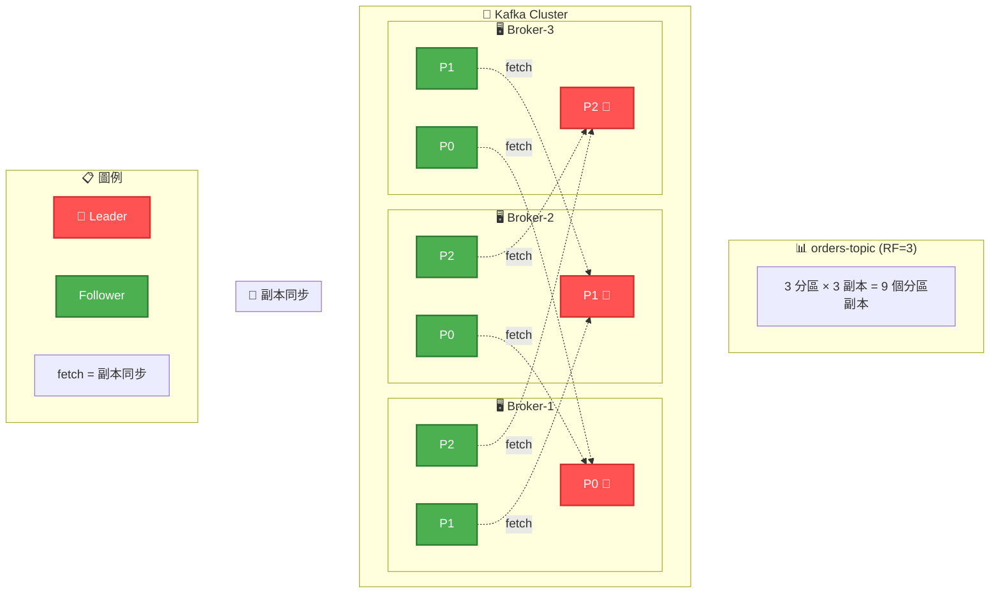
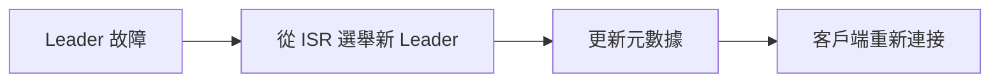

# Kafka 分區和副本分布圖

## 概述
此圖展示 Kafka Topic 分區在不同 Broker 上的分布，以及 Leader/Follower 副本的配置。

## Mermaid 圖表



## 分區分布策略

### 分區分配原則
1. **均勻分布**: 分區盡可能均勻分布到所有 Broker
2. **副本分離**: 同一分區的副本不在同一 Broker
3. **負載平衡**: Leader 分區均勻分布
4. **機架感知**: 考慮機架拓撲避免單點故障

### 副本配置詳情

#### orders-topic (3 分區, 3 副本)
| 分區 | Leader | Follower 1 | Follower 2 | ISR | 說明 |
|------|--------|------------|------------|-----|------|
| P0 | Broker-1 🔴 | Broker-2 | Broker-3 | [1,2,3] | 輪流領導 |
| P1 | Broker-2 🔴 | Broker-1 | Broker-3 | [2,1,3] | 負載平衡 |
| P2 | Broker-3 🔴 | Broker-1 | Broker-2 | [3,1,2] | 高可用性 |

> **🎯 核心概念**：每個 Broker 既是某個分區的 Leader，也是其他分區的 Follower，實現負載均衡。

## 關鍵概念

### Leader 和 Follower
- **Leader**: 處理所有讀寫請求的主副本
- **Follower**: 被動複製 Leader 資料的副本
- **ISR**: In-Sync Replicas，與 Leader 保持同步的副本集合

### 容錯機制


### 效能考量

#### 讀寫分離
- **寫入**: 只能寫入 Leader
- **讀取**: 預設從 Leader 讀取，可配置從 Follower 讀取

#### 分區策略影響
1. **並行度**: 分區數決定最大並行消費者數
2. **儲存**: 分區分布影響儲存均衡
3. **網路**: 副本同步產生網路流量

## 管理操作

### 分區重分配
```bash
# 生成重分配計劃
kafka-reassign-partitions.sh --generate

# 執行重分配
kafka-reassign-partitions.sh --execute

# 驗證重分配
kafka-reassign-partitions.sh --verify
```

### 副本同步監控
- **Lag 監控**: 監控 Follower 落後程度
- **ISR 變化**: 追蹤 ISR 成員變化
- **Under-replicated**: 識別副本不足的分區

## 最佳實踐

### 分區數量規劃
- 考慮預期吞吐量和並行度需求
- 避免過多分區影響元數據管理
- 預留擴展空間但不過度配置

### 副本因子選擇
- **生產環境**: 建議 RF ≥ 3
- **開發環境**: RF = 1 或 2 即可
- **關鍵資料**: 考慮更高的副本因子

### 機架感知配置
```properties
# 配置 Broker 機架資訊
broker.rack=rack1

# 啟用機架感知分配
replica.selector.class=org.apache.kafka.common.replica.RackAwareReplicaSelector
```