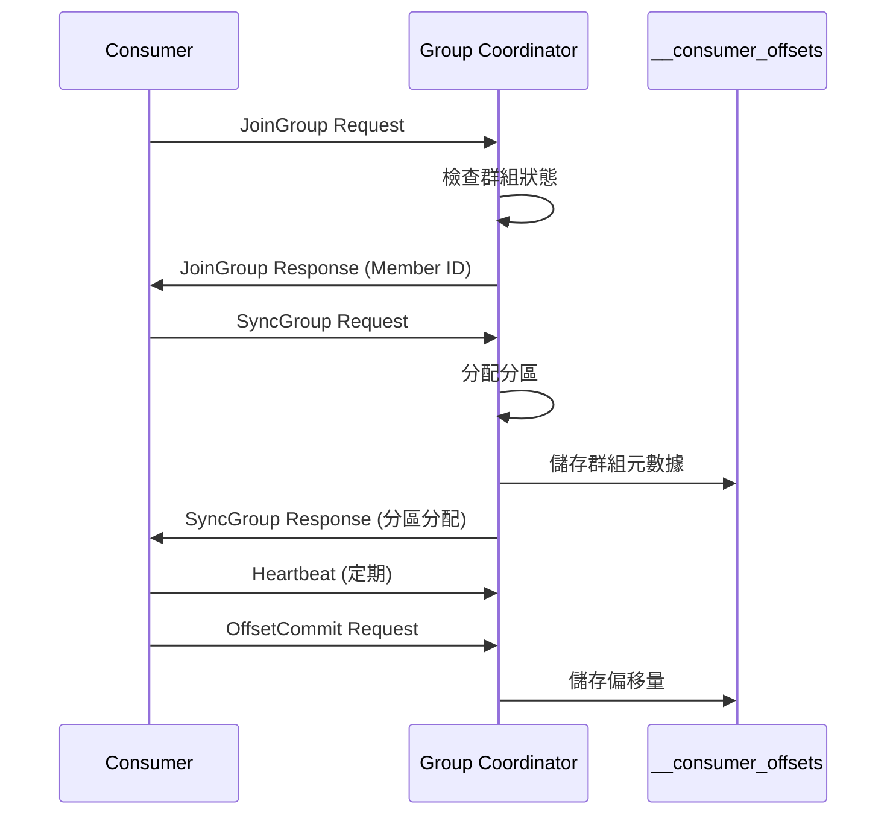
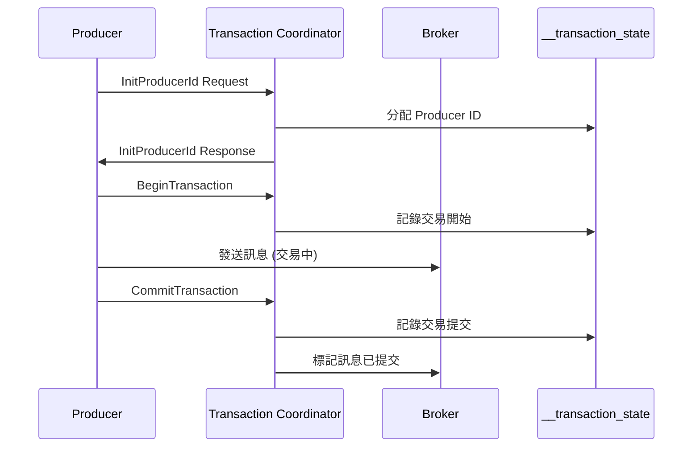

# Kafka 協調器架構圖

## 概述
此圖展示 Kafka 中各種協調器的組織結構和職責分工，包括群組協調器、交易協調器等。

## Mermaid 圖表

```mermaid
graph TB
    %% 定義樣式
    classDef coordinator fill:#ffcdd2,stroke:#d32f2f,stroke-width:2px,color:#000
    classDef client fill:#c8e6c9,stroke:#388e3c,stroke-width:2px,color:#000
    classDef broker fill:#e1f5fe,stroke:#0277bd,stroke-width:2px,color:#000
    classDef topic fill:#f3e5f5,stroke:#7b1fa2,stroke-width:2px,color:#000
    classDef state fill:#fff3e0,stroke:#f57c00,stroke-width:2px,color:#000

    %% 客戶端層
    subgraph "客戶端應用"
        CG1[Consumer Group 1<br/>group.id: app-1]:::client
        CG2[Consumer Group 2<br/>group.id: app-2]:::client
        TP1[Transactional Producer<br/>transactional.id: tx-1]:::client
        TP2[Transactional Producer<br/>transactional.id: tx-2]:::client
        SC1[Share Consumer Group<br/>group.id: share-1]:::client
    end

    %% Kafka 叢集協調器層
    subgraph "Kafka Cluster - Coordinators"
        subgraph "Broker 1"
            B1[Broker 1]:::broker
            GC1[Group Coordinator<br/>負責: app-1, share-1]:::coordinator
            TC1[Transaction Coordinator<br/>負責: tx-1]:::coordinator
        end

        subgraph "Broker 2"
            B2[Broker 2]:::broker
            GC2[Group Coordinator<br/>負責: app-2]:::coordinator
            TC2[Transaction Coordinator<br/>負責: tx-2]:::coordinator
            SC2[Share Coordinator<br/>負責: share-1]:::coordinator
        end

        subgraph "Broker 3"
            B3[Broker 3]:::broker
            GC3[Group Coordinator<br/>備用]:::coordinator
            TC3[Transaction Coordinator<br/>備用]:::coordinator
        end
    end

    %% 內部 Topics (協調器狀態儲存)
    subgraph "Internal Topics"
        CGT[__consumer_offsets<br/>Consumer Group 元數據<br/>Partitions: 50]:::topic
        TT[__transaction_state<br/>交易狀態<br/>Partitions: 50]:::topic
        ST[__share_group_state<br/>Share Group 狀態<br/>Partitions: 50]:::topic
    end

    %% 協調器狀態
    subgraph "Coordinator States"
        GS[Group States<br/>- Empty<br/>- PreparingRebalance<br/>- CompletingRebalance<br/>- Stable<br/>- Dead]:::state
        TS[Transaction States<br/>- Empty<br/>- Ongoing<br/>- PrepareCommit<br/>- PrepareAbort<br/>- CompleteCommit<br/>- CompleteAbort]:::state
        SS[Share States<br/>- Empty<br/>- Stable<br/>- PreparingRebalance<br/>- CompletingRebalance]:::state
    end

    %% 連接關係 - 客戶端到協調器
    CG1 --> GC1
    CG2 --> GC2
    TP1 --> TC1
    TP2 --> TC2
    SC1 --> GC1
    SC1 --> SC2

    %% 協調器到內部 Topics
    GC1 --> CGT
    GC2 --> CGT
    GC3 --> CGT
    TC1 --> TT
    TC2 --> TT
    TC3 --> TT
    SC2 --> ST

    %% 狀態管理
    GC1 -.-> GS
    GC2 -.-> GS
    TC1 -.-> TS
    TC2 -.-> TS
    SC2 -.-> SS
```



## 協調器詳細說明

### Group Coordinator (群組協調器)

#### 職責範圍
- **Consumer Group 管理**: 管理消費者群組的成員和分區分配
- **Offset 管理**: 儲存和管理消費者的偏移量
- **重平衡協調**: 處理消費者加入/離開時的重平衡

#### 工作流程


#### 狀態轉換
- **Empty**: 無活躍成員
- **PreparingRebalance**: 準備重平衡
- **CompletingRebalance**: 完成重平衡
- **Stable**: 穩定運行
- **Dead**: 群組已刪除

### Transaction Coordinator (交易協調器)

#### 職責範圍
- **交易狀態管理**: 追蹤交易的生命週期
- **Producer ID 管理**: 分配和管理 Producer ID
- **交易日誌**: 維護交易狀態變更日誌

#### 交易流程


#### 交易狀態
- **Empty**: 無活躍交易
- **Ongoing**: 交易進行中
- **PrepareCommit/PrepareAbort**: 準備提交/中止
- **CompleteCommit/CompleteAbort**: 完成提交/中止

### Share Coordinator (共享協調器)

#### 職責範圍
- **Share Group 管理**: 管理共享消費群組
- **分區鎖定**: 協調分區的獨占訪問
- **進度追蹤**: 追蹤共享消費進度

#### 特殊功能
- **動態分配**: 動態分配分區給可用消費者
- **故障恢復**: 處理消費者故障時的分區重分配
- **負載平衡**: 根據消費速度調整分區分配

## 協調器選擇機制

### Hash 分配算法
```java
// Group Coordinator 選擇
int partition = Math.abs(groupId.hashCode()) % numPartitions;
int coordinatorBroker = partitionLeader(partition);

// Transaction Coordinator 選擇  
int partition = Math.abs(transactionalId.hashCode()) % numPartitions;
int coordinatorBroker = partitionLeader(partition);
```

### 容錯機制
1. **Leader 選舉**: 協調器所在分區的 Leader 故障時自動選舉
2. **狀態恢復**: 從內部 Topic 恢復協調器狀態
3. **客戶端重試**: 客戶端自動重新連接新的協調器

## 效能優化

### 分區配置
- **__consumer_offsets**: 預設 50 個分區
- **__transaction_state**: 預設 50 個分區
- 可根據叢集規模調整分區數

### 批次處理
- **Offset 提交**: 支援批次提交多個偏移量
- **交易操作**: 批次處理交易狀態變更
- **心跳優化**: 合併多個心跳請求

## 監控指標

### Group Coordinator 指標
- `kafka.coordinator.group.NumGroups`: 活躍群組數
- `kafka.coordinator.group.NumOffsets`: 儲存的偏移量數
- `kafka.coordinator.group.PartitionLoadTime`: 分區載入時間

### Transaction Coordinator 指標
- `kafka.coordinator.transaction.NumTransactions`: 活躍交易數
- `kafka.coordinator.transaction.TransactionStartRate`: 交易開始速率
- `kafka.coordinator.transaction.TransactionAbortRate`: 交易中止速率

## 最佳實踐

### 配置建議
```properties
# 增加協調器執行緒數
num.network.threads=8
num.io.threads=16

# 調整內部 Topic 配置
offsets.topic.num.partitions=50
offsets.topic.replication.factor=3
transaction.state.log.num.partitions=50
transaction.state.log.replication.factor=3
```

### 故障排除
1. **重平衡過於頻繁**: 調整 `session.timeout.ms` 和 `heartbeat.interval.ms`
2. **交易超時**: 調整 `transaction.timeout.ms`
3. **協調器負載過高**: 增加內部 Topic 分區數
