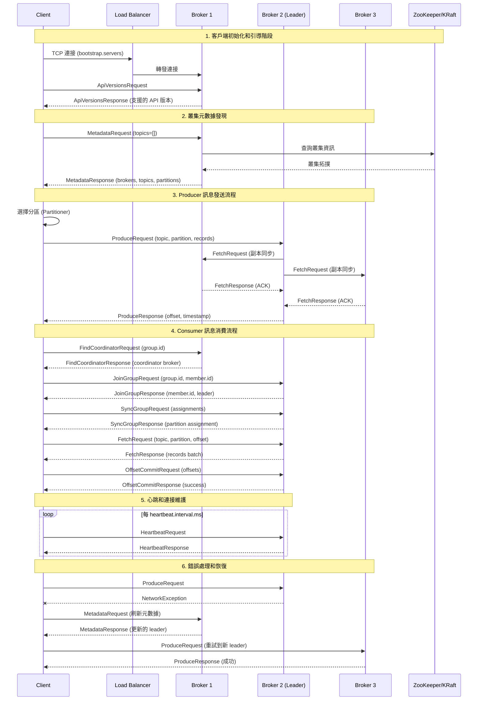
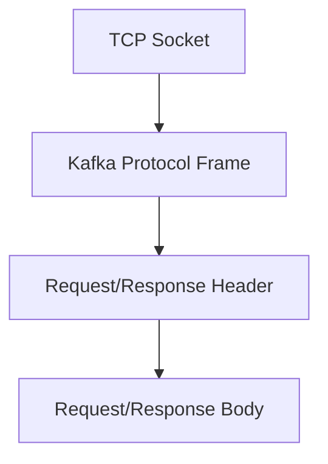
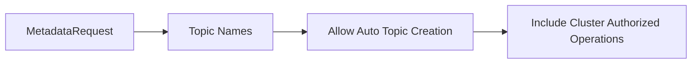
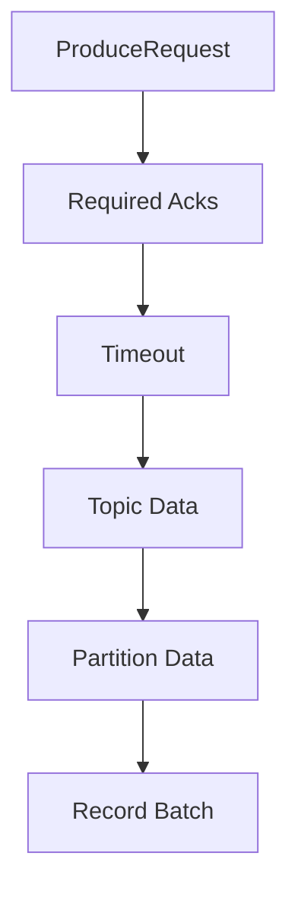
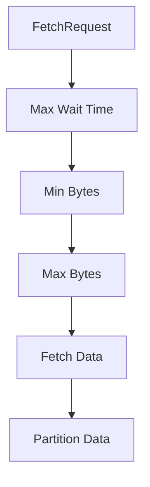
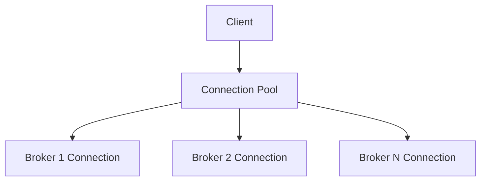
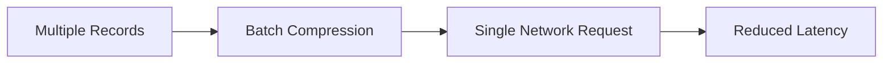
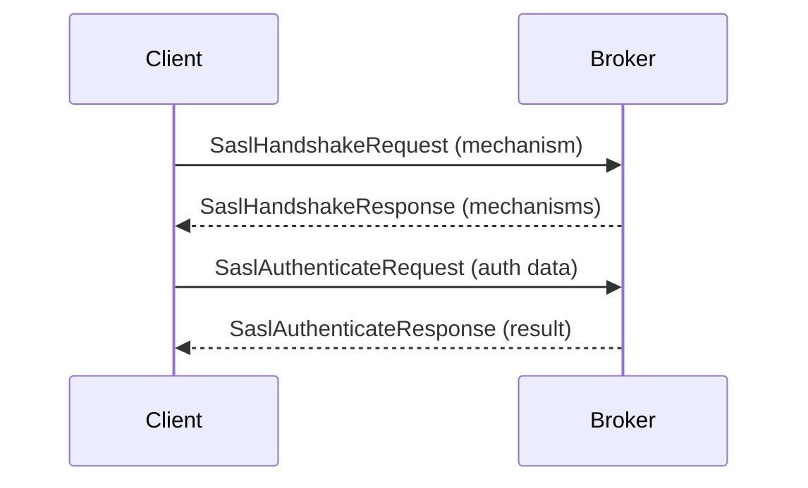
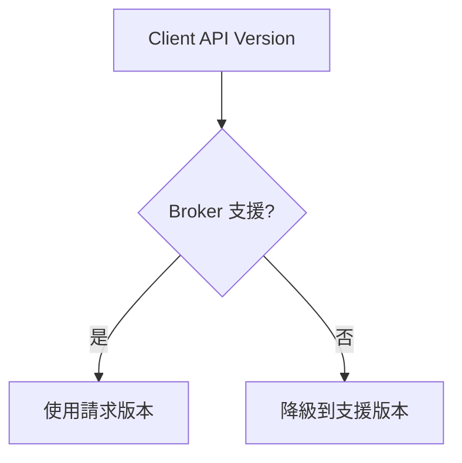

# Kafka 網路協定互動圖

## 概述
此圖展示客戶端與 Broker 之間的通訊協定，包括請求/回應流程和元數據更新機制。

## Mermaid 圖表



## 協定層次結構

### TCP 層


### 協定格式
```
+------------------+
| Message Size (4) |
+------------------+
| Request Header   |
+------------------+
| Request Body     |
+------------------+
```

## 核心 API 協定

### 1. ApiVersions API
- **目的**: 協商客戶端和 Broker 支援的 API 版本
- **時機**: 連接建立後的第一個請求
- **版本協商**: 確保相容性

### 2. Metadata API


**回應內容**:
- Broker 清單和連接資訊
- Topic 分區配置
- Leader/Follower 分配

### 3. Produce API


**確認模式**:
- `acks=0`: 不等待確認
- `acks=1`: 等待 Leader 確認
- `acks=all`: 等待所有 ISR 確認

### 4. Fetch API


**優化參數**:
- `fetch.min.bytes`: 最小批次大小
- `fetch.max.wait.ms`: 最大等待時間
- `max.partition.fetch.bytes`: 單分區最大資料量

## 連接管理

### 連接池


### 連接狀態
- **CONNECTING**: 正在建立連接
- **CONNECTED**: 已建立連接
- **DISCONNECTED**: 連接已斷開
- **AUTHENTICATION_FAILED**: 認證失敗

## 錯誤處理機制

### 可重試錯誤
- `NETWORK_EXCEPTION`: 網路異常
- `REQUEST_TIMED_OUT`: 請求超時
- `NOT_LEADER_FOR_PARTITION`: 不是分區 Leader
- `LEADER_NOT_AVAILABLE`: Leader 不可用

### 不可重試錯誤
- `INVALID_TOPIC_EXCEPTION`: 無效 Topic
- `AUTHORIZATION_FAILED`: 授權失敗
- `UNSUPPORTED_VERSION`: 不支援的版本

## 效能優化

### 批次處理


### 管道化 (Pipelining)
- 允許多個未完成的請求
- 提高網路利用率
- 配置 `max.in.flight.requests.per.connection`

### 壓縮
支援的壓縮算法:
- **gzip**: 高壓縮率，CPU 密集
- **snappy**: 平衡壓縮率和速度
- **lz4**: 快速壓縮
- **zstd**: 新一代高效壓縮

## 安全協定

### SASL 認證流程


### SSL/TLS 加密
- **握手**: SSL 憑證驗證
- **加密**: 資料傳輸加密
- **效能**: 增加 CPU 開銷

## 監控和診斷

### 網路指標
- `network-io-rate`: 網路 I/O 速率
- `request-latency-avg`: 平均請求延遲
- `request-rate`: 請求速率
- `response-rate`: 回應速率

### 連接指標
- `connection-count`: 活躍連接數
- `connection-creation-rate`: 連接建立速率
- `connection-close-rate`: 連接關閉速率

## 協定版本演進

### 版本相容性


### 新功能支援
- **向後相容**: 新版本支援舊協定
- **功能檢測**: 透過 ApiVersions 檢測功能
- **優雅降級**: 不支援時使用替代方案

## 最佳實踐

### 客戶端配置
```properties
# 連接配置
bootstrap.servers=broker1:9092,broker2:9092,broker3:9092
connections.max.idle.ms=540000
request.timeout.ms=30000

# 重試配置
retries=2147483647
retry.backoff.ms=100
delivery.timeout.ms=120000

# 批次配置
batch.size=16384
linger.ms=5
```

### 網路調優
```properties
# Socket 緩衝區
send.buffer.bytes=131072
receive.buffer.bytes=65536

# 壓縮配置
compression.type=snappy

# 並發控制
max.in.flight.requests.per.connection=5
```
