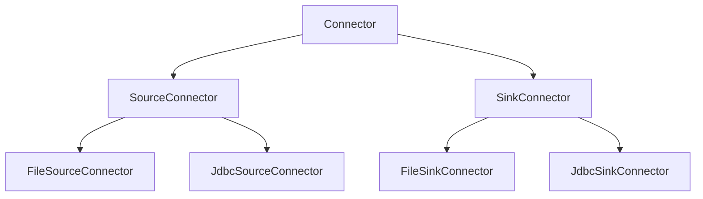
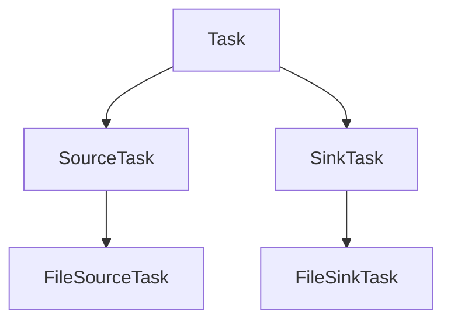

# Kafka 類別關係圖

## 概述
此圖展示 Kafka 核心類別之間的繼承和組合關係，幫助理解 API 設計和類別結構。

## Mermaid 圖表

```mermaid
classDiagram
    %% Producer 相關類別
    class Producer {
        <<interface>>
        +send(ProducerRecord) Future~RecordMetadata~
        +flush() void
        +close() void
    }

    class KafkaProducer {
        -Sender sender
        -RecordAccumulator accumulator
        -Metadata metadata
        +send(ProducerRecord) Future~RecordMetadata~
        +initTransactions() void
        +beginTransaction() void
        +commitTransaction() void
    }

    class ProducerRecord {
        -String topic
        -Integer partition
        -K key
        -V value
        -Long timestamp
        +topic() String
        +partition() Integer
        +key() K
        +value() V
    }

    %% Consumer 相關類別
    class Consumer {
        <<interface>>
        +subscribe(Collection~String~) void
        +poll(Duration) ConsumerRecords~K,V~
        +commitSync() void
        +commitAsync() void
    }

    class KafkaConsumer {
        -ConsumerCoordinator coordinator
        -Fetcher fetcher
        -SubscriptionState subscriptions
        +subscribe(Collection~String~) void
        +poll(Duration) ConsumerRecords~K,V~
        +assign(Collection~TopicPartition~) void
    }

    class ConsumerRecord {
        -String topic
        -int partition
        -long offset
        -K key
        -V value
        -long timestamp
        +topic() String
        +partition() int
        +offset() long
    }

    class ConsumerRecords {
        -Map~TopicPartition, List~ConsumerRecord~~ records
        +records(String) Iterable~ConsumerRecord~
        +records(TopicPartition) List~ConsumerRecord~
        +isEmpty() boolean
    }

    %% Streams 相關類別
    class KafkaStreams {
        -StreamThread[] threads
        -GlobalStreamThread globalStreamThread
        -StateDirectory stateDirectory
        +start() void
        +close() void
        +state() State
    }

    class StreamsBuilder {
        -InternalTopologyBuilder internalTopologyBuilder
        +stream(String) KStream~K,V~
        +table(String) KTable~K,V~
        +globalTable(String) GlobalKTable~K,V~
        +build() Topology
    }

    class KStream {
        <<interface>>
        +filter(Predicate) KStream~K,V~
        +map(KeyValueMapper) KStream~KR,VR~
        +groupByKey() KGroupedStream~K,V~
        +to(String) void
    }

    class KTable {
        <<interface>>
        +filter(Predicate) KTable~K,V~
        +mapValues(ValueMapper) KTable~K,VR~
        +groupBy(KeyValueMapper) KGroupedTable~KR,V~
        +toStream() KStream~K,V~
    }

    class Topology {
        -Map~String, TopologyDescription.Node~ nodeGroups
        +addSource(String, String...) Topology
        +addProcessor(String, ProcessorSupplier, String...) Topology
        +addSink(String, String, String...) Topology
    }

    %% Connect 相關類別
    class Connector {
        <<abstract>>
        +version() String
        +start(Map~String,String~) void
        +taskClass() Class~Task~
        +taskConfigs(int) List~Map~String,String~~
        +stop() void
    }

    class SourceConnector {
        +taskClass() Class~SourceTask~
    }

    class SinkConnector {
        +taskClass() Class~SinkTask~
    }

    class Task {
        <<interface>>
        +version() String
        +start(Map~String,String~) void
        +stop() void
    }

    class SourceTask {
        +poll() List~SourceRecord~
    }

    class SinkTask {
        +put(Collection~SinkRecord~) void
        +flush(Map~TopicPartition,OffsetAndMetadata~) void
    }

    %% 通用類別
    class TopicPartition {
        -String topic
        -int partition
        +topic() String
        +partition() int
        +equals(Object) boolean
        +hashCode() int
    }

    class OffsetAndMetadata {
        -long offset
        -String metadata
        +offset() long
        +metadata() String
    }

    class Serializer {
        <<interface>>
        +serialize(String, T) byte[]
        +close() void
    }

    class Deserializer {
        <<interface>>
        +deserialize(String, byte[]) T
        +close() void
    }

    %% 繼承關係
    Producer <|.. KafkaProducer
    Consumer <|.. KafkaConsumer
    Connector <|-- SourceConnector
    Connector <|-- SinkConnector
    Task <|.. SourceTask
    Task <|.. SinkTask

    %% 組合關係
    KafkaProducer *-- ProducerRecord
    KafkaConsumer *-- ConsumerRecord
    KafkaConsumer *-- ConsumerRecords
    ConsumerRecords *-- ConsumerRecord
    KafkaStreams *-- StreamsBuilder
    StreamsBuilder *-- Topology
    StreamsBuilder ..> KStream
    StreamsBuilder ..> KTable
    SourceTask ..> ProducerRecord
    SinkTask ..> ConsumerRecord

    %% 依賴關係
    ProducerRecord --> TopicPartition
    ConsumerRecord --> TopicPartition
    KafkaConsumer --> OffsetAndMetadata
    KafkaProducer --> Serializer
    KafkaConsumer --> Deserializer
```



## 核心類別詳解

### Producer API 層次

#### Producer Interface
- **職責**: 定義生產者的基本契約
- **關鍵方法**: `send()`, `flush()`, `close()`
- **設計模式**: 策略模式，允許不同實作

#### KafkaProducer Class
- **實作**: Producer 介面的具體實作
- **核心組件**:
  - `Sender`: 負責網路傳輸
  - `RecordAccumulator`: 訊息批次累積
  - `Metadata`: 叢集元數據管理
- **特性**: 執行緒安全，支援交易

### Consumer API 層次

#### Consumer Interface
- **職責**: 定義消費者的基本契約
- **關鍵方法**: `subscribe()`, `poll()`, `commit()`
- **消費模式**: 支援訂閱和指派兩種模式

#### KafkaConsumer Class
- **實作**: Consumer 介面的具體實作
- **核心組件**:
  - `ConsumerCoordinator`: 群組協調
  - `Fetcher`: 資料拉取
  - `SubscriptionState`: 訂閱狀態管理
- **特性**: 非執行緒安全，單執行緒使用

### Streams API 層次

#### KafkaStreams Class
- **職責**: Streams 應用的主要入口點
- **生命週期**: `start()` → `running` → `close()`
- **執行緒模型**: 多執行緒處理，每個執行緒處理多個任務

#### StreamsBuilder Class
- **職責**: 建構處理拓撲的 DSL
- **流抽象**: 提供 `KStream` 和 `KTable` 抽象
- **拓撲建構**: 透過 fluent API 建構處理圖

### Connect API 層次

#### Connector Hierarchy


#### Task Hierarchy


## 設計模式應用

### 1. 策略模式 (Strategy Pattern)
```java
// Serializer 策略
KafkaProducer<String, User> producer = new KafkaProducer<>(
    props,
    new StringSerializer(),    // Key 序列化策略
    new JsonSerializer<>()     // Value 序列化策略
);
```

### 2. 建造者模式 (Builder Pattern)
```java
// StreamsBuilder 建構拓撲
StreamsBuilder builder = new StreamsBuilder();
KStream<String, String> stream = builder.stream("input-topic")
    .filter((key, value) -> value != null)
    .mapValues(String::toUpperCase)
    .to("output-topic");
```

### 3. 觀察者模式 (Observer Pattern)
```java
// Consumer 狀態變化監聽
consumer.subscribe(Arrays.asList("topic"), new ConsumerRebalanceListener() {
    public void onPartitionsRevoked(Collection<TopicPartition> partitions) {
        // 處理分區撤銷
    }
    public void onPartitionsAssigned(Collection<TopicPartition> partitions) {
        // 處理分區分配
    }
});
```

### 4. 模板方法模式 (Template Method Pattern)
```java
// Connector 抽象類定義模板
public abstract class Connector {
    public final void initialize(ConnectorContext ctx) {
        // 通用初始化邏輯
        start(config);  // 子類實作
    }
    
    public abstract void start(Map<String, String> props);
}
```

## 類別關係特點

### 組合 vs 繼承
- **組合優先**: 大多數功能透過組合實現
- **介面隔離**: 清晰的介面定義
- **依賴注入**: 支援自定義實作注入

### 執行緒安全性
- **Producer**: 執行緒安全，可多執行緒共享
- **Consumer**: 非執行緒安全，單執行緒使用
- **Streams**: 內部管理執行緒，外部單執行緒操作

### 擴展性設計
- **插件架構**: Serializer、Partitioner 可插拔
- **SPI 機制**: 支援服務提供者介面
- **配置驅動**: 透過配置控制行為

## 最佳實踐

### API 使用建議
1. **Producer**: 單例模式，應用級別共享
2. **Consumer**: 每個執行緒一個實例
3. **Streams**: 每個應用一個 KafkaStreams 實例

### 資源管理
```java
// 正確的資源管理
try (KafkaProducer<String, String> producer = new KafkaProducer<>(props)) {
    producer.send(record);
} // 自動關閉資源
```

### 錯誤處理
```java
// 異步發送與錯誤處理
producer.send(record, (metadata, exception) -> {
    if (exception != null) {
        logger.error("發送失敗", exception);
    } else {
        logger.info("發送成功: {}", metadata);
    }
});
```
