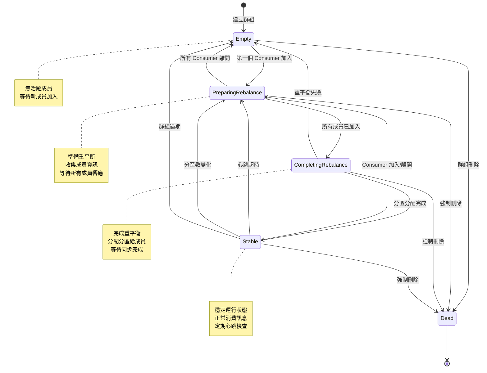
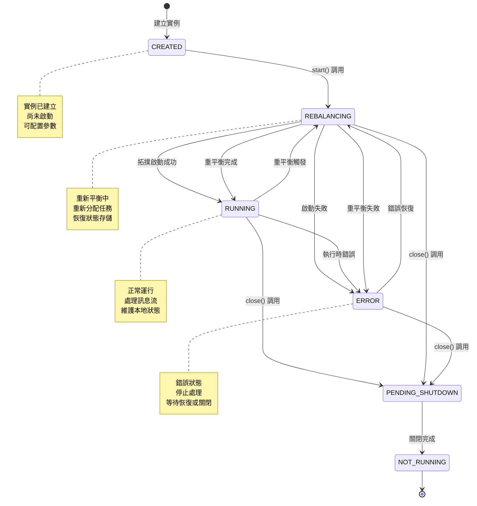
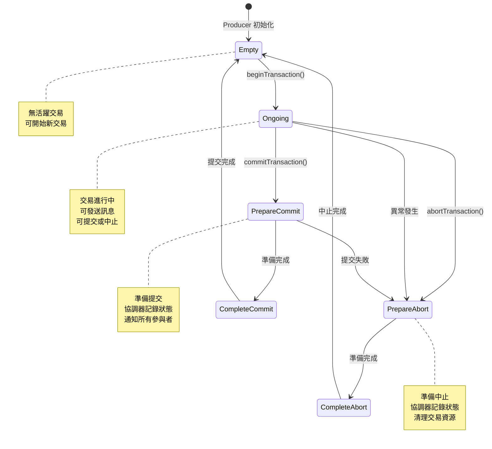
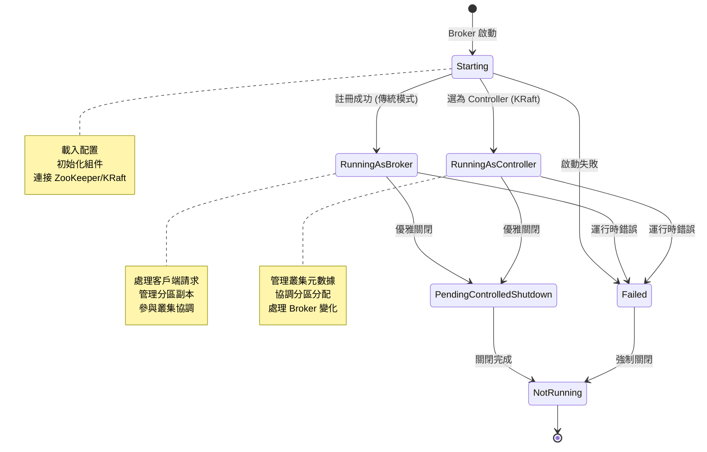
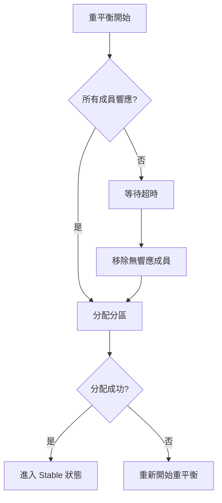
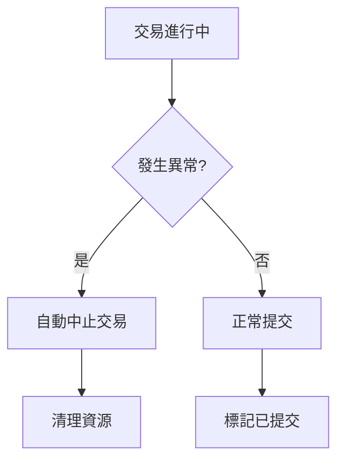

# Kafka 狀態機圖

## 概述
此圖展示 Kafka 各個組件的狀態轉換，包括 Consumer Group、Streams 應用、交易等的生命週期。

## Mermaid 圖表

### Consumer Group 狀態機



### KafkaStreams 應用狀態機



### 交易狀態機



### Broker 狀態機



## 狀態轉換觸發條件

### Consumer Group 狀態轉換

| 當前狀態 | 觸發事件 | 目標狀態 | 說明 |
|----------|----------|----------|------|
| Empty | Consumer 加入 | PreparingRebalance | 第一個成員加入群組 |
| Stable | Consumer 加入/離開 | PreparingRebalance | 成員變化觸發重平衡 |
| Stable | 心跳超時 | PreparingRebalance | 成員被認為已離線 |
| PreparingRebalance | 所有成員響應 | CompletingRebalance | 進入分區分配階段 |
| CompletingRebalance | 分配完成 | Stable | 重平衡成功完成 |

### KafkaStreams 狀態轉換

| 當前狀態 | 觸發事件 | 目標狀態 | 說明 |
|----------|----------|----------|------|
| CREATED | start() | REBALANCING | 開始啟動流程 |
| RUNNING | 成員變化 | REBALANCING | 觸發任務重分配 |
| RUNNING | 異常 | ERROR | 處理過程中發生錯誤 |
| ERROR | 恢復 | REBALANCING | 錯誤恢復後重新平衡 |
| 任何狀態 | close() | PENDING_SHUTDOWN | 開始關閉流程 |

## 狀態監控和診斷

### JMX 指標監控

#### Consumer Group 指標
```java
// 群組狀態監控
"kafka.coordinator.group:type=GroupMetadataManager,name=NumGroups"
"kafka.coordinator.group:type=GroupMetadataManager,name=NumGroupsPreparingRebalance"
"kafka.coordinator.group:type=GroupMetadataManager,name=NumGroupsCompletingRebalance"
"kafka.coordinator.group:type=GroupMetadataManager,name=NumGroupsStable"
```

#### Streams 應用指標
```java
// Streams 狀態監控
"kafka.streams:type=kafka-streams-state,client-id=*"
"kafka.streams:type=stream-thread-metrics,thread-id=*"
```

### 狀態變化日誌

#### Consumer Group 日誌
```log
[GroupCoordinator] Group app-group transitioned from Stable to PreparingRebalance
[GroupCoordinator] Member consumer-1 joined group app-group
[GroupCoordinator] Group app-group transitioned from PreparingRebalance to CompletingRebalance
```

#### Streams 應用日誌
```log
[StreamThread] State transition from RUNNING to REBALANCING
[StreamThread] Partition assignment: {topic-0=[0,1], topic-1=[2,3]}
[StreamThread] State transition from REBALANCING to RUNNING
```

## 異常處理和恢復

### 重平衡異常處理


### 交易異常處理


## 最佳實踐

### 狀態監控配置
```properties
# Consumer Group 監控
group.id=my-app-group
session.timeout.ms=30000
heartbeat.interval.ms=3000
max.poll.interval.ms=300000

# Streams 應用監控
application.id=my-streams-app
commit.interval.ms=30000
state.dir=/tmp/kafka-streams
```

### 異常處理策略
```java
// Consumer 異常處理
consumer.subscribe(topics, new ConsumerRebalanceListener() {
    @Override
    public void onPartitionsRevoked(Collection<TopicPartition> partitions) {
        // 保存處理進度
        commitOffsets();
    }
    
    @Override
    public void onPartitionsAssigned(Collection<TopicPartition> partitions) {
        // 恢復處理狀態
        restoreState();
    }
});

// Streams 異常處理
streams.setUncaughtExceptionHandler((thread, exception) -> {
    logger.error("Streams thread {} encountered error", thread.getName(), exception);
    return StreamsUncaughtExceptionHandler.StreamThreadExceptionResponse.REPLACE_THREAD;
});
```

### 狀態轉換優化
1. **減少重平衡頻率**: 調整心跳和會話超時參數
2. **快速故障檢測**: 縮短檢測時間但避免誤判
3. **優雅關閉**: 實作正確的關閉流程避免資源洩漏
