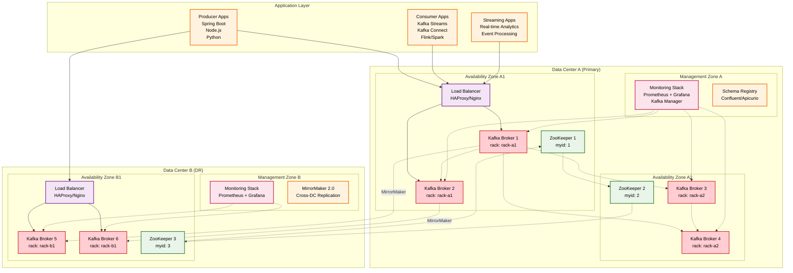
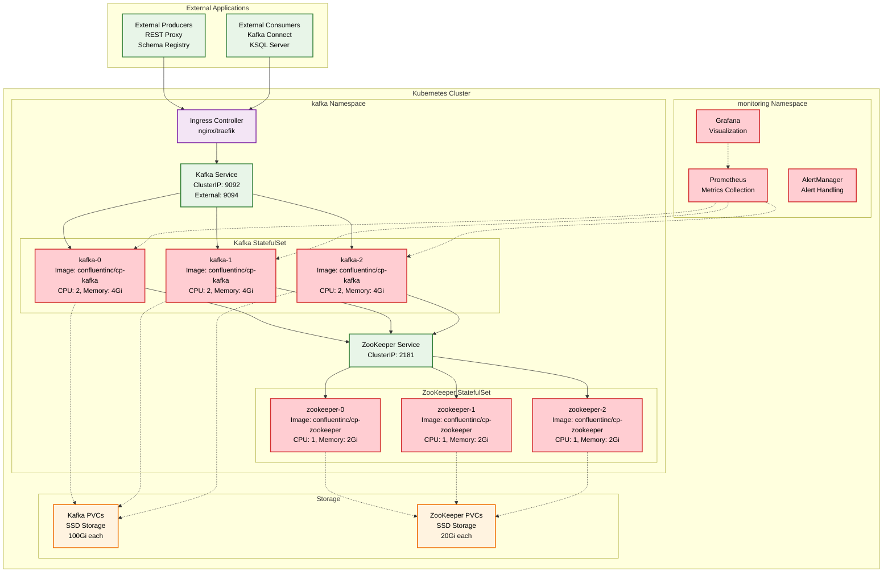
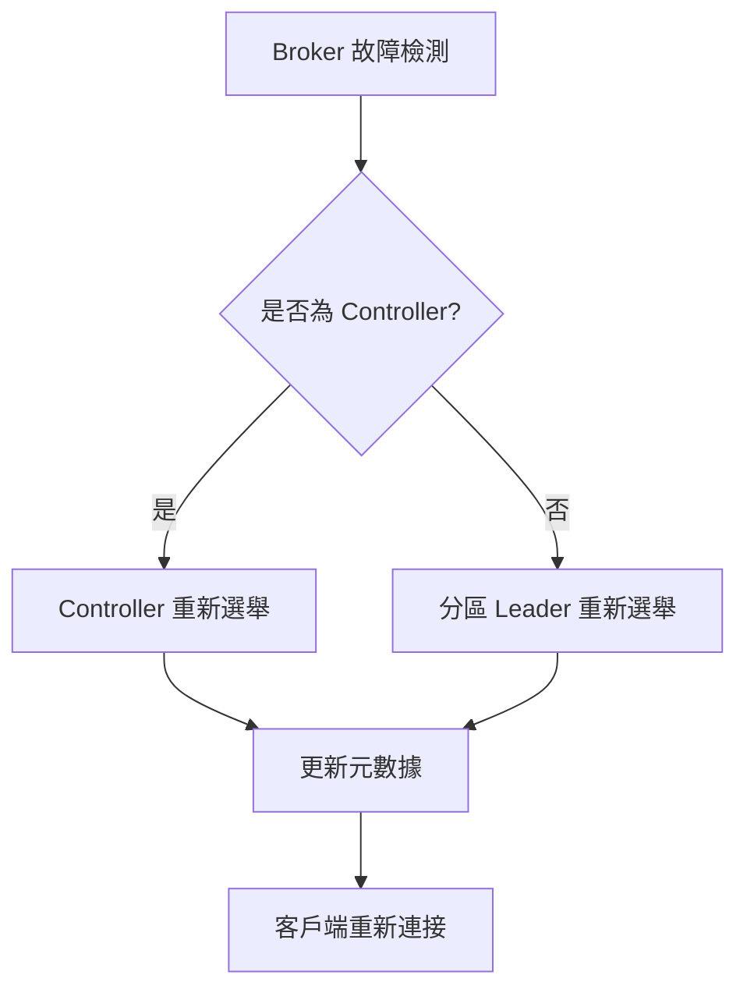
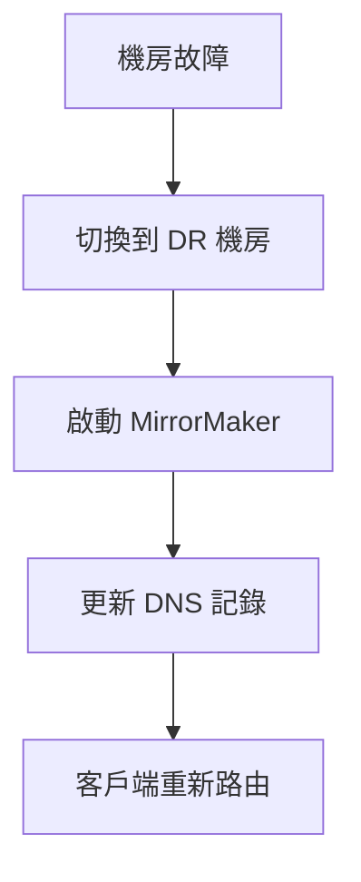

# Kafka 部署架構圖

## 概述
此圖展示 Kafka 在實際生產環境中的部署方式，包括多機房部署、容器化部署和雲端部署。

## Mermaid 圖表

### 多機房部署架構



### 容器化部署架構 (Kubernetes)



### 雲端部署架構 (AWS/Azure/GCP)

```mermaid
graph TB
    %% 定義樣式
    classDef cloud fill:#e3f2fd,stroke:#1565c0,stroke-width:2px,color:#000
    classDef compute fill:#ffcdd2,stroke:#d32f2f,stroke-width:2px,color:#000
    classDef storage fill:#e8f5e8,stroke:#2e7d32,stroke-width:2px,color:#000
    classDef network fill:#fff3e0,stroke:#ef6c00,stroke-width:2px,color:#000
    classDef managed fill:#f3e5f5,stroke:#7b1fa2,stroke-width:2px,color:#000

    %% 雲端區域
    subgraph "Cloud Region (us-east-1)"
        subgraph "Availability Zone A"
            %% 計算資源
            EC2_A1[EC2 Instance<br/>m5.2xlarge<br/>Kafka Broker 1]:::compute
            EC2_A2[EC2 Instance<br/>m5.2xlarge<br/>Kafka Broker 2]:::compute
            
            %% 儲存
            EBS_A1[EBS Volume<br/>gp3, 1TB<br/>IOPS: 3000]:::storage
            EBS_A2[EBS Volume<br/>gp3, 1TB<br/>IOPS: 3000]:::storage
        end
        
        subgraph "Availability Zone B"
            EC2_B1[EC2 Instance<br/>m5.2xlarge<br/>Kafka Broker 3]:::compute
            EC2_B2[EC2 Instance<br/>t3.large<br/>ZooKeeper 1]:::compute
            
            EBS_B1[EBS Volume<br/>gp3, 1TB<br/>IOPS: 3000]:::storage
            EBS_B2[EBS Volume<br/>gp3, 100GB<br/>IOPS: 1000]:::storage
        end
        
        subgraph "Availability Zone C"
            EC2_C1[EC2 Instance<br/>m5.2xlarge<br/>Kafka Broker 4]:::compute
            EC2_C2[EC2 Instance<br/>t3.large<br/>ZooKeeper 2]:::compute
            EC2_C3[EC2 Instance<br/>t3.large<br/>ZooKeeper 3]:::compute
            
            EBS_C1[EBS Volume<br/>gp3, 1TB<br/>IOPS: 3000]:::storage
            EBS_C2[EBS Volume<br/>gp3, 100GB<br/>IOPS: 1000]:::storage
            EBS_C3[EBS Volume<br/>gp3, 100GB<br/>IOPS: 1000]:::storage
        end
    end

    %% 網路層
    subgraph "Network Layer"
        VPC[VPC<br/>10.0.0.0/16]:::network
        ALB[Application Load Balancer<br/>Multi-AZ]:::network
        NLB[Network Load Balancer<br/>TCP 9092]:::network
        SG[Security Groups<br/>Port 9092, 2181, 22]:::network
    end

    %% 託管服務
    subgraph "Managed Services"
        MSK[Amazon MSK<br/>Managed Kafka Service<br/>3 Brokers, m5.large]:::managed
        CLOUDWATCH[CloudWatch<br/>Metrics & Logs]:::managed
        S3[S3 Bucket<br/>Backup & Archive]:::managed
        IAM[IAM Roles<br/>Access Control]:::managed
    end

    %% 應用層
    subgraph "Application Services"
        ECS[ECS/Fargate<br/>Containerized Apps]:::compute
        LAMBDA[Lambda Functions<br/>Event Processing]:::compute
        KINESIS[Kinesis Analytics<br/>Stream Processing]:::managed
    end

    %% 連接關係
    ALB --> EC2_A1
    ALB --> EC2_A2
    ALB --> EC2_B1
    ALB --> EC2_C1
    
    NLB --> EC2_A1
    NLB --> EC2_A2
    NLB --> EC2_B1
    NLB --> EC2_C1
    
    EC2_A1 -.-> EBS_A1
    EC2_A2 -.-> EBS_A2
    EC2_B1 -.-> EBS_B1
    EC2_C1 -.-> EBS_C1
    
    EC2_B2 -.-> EBS_B2
    EC2_C2 -.-> EBS_C2
    EC2_C3 -.-> EBS_C3
    
    ECS --> NLB
    LAMBDA --> MSK
    KINESIS --> MSK
    
    CLOUDWATCH -.-> EC2_A1
    CLOUDWATCH -.-> EC2_A2
    CLOUDWATCH -.-> EC2_B1
    CLOUDWATCH -.-> EC2_C1
```



## 部署配置詳解

### 硬體規格建議

#### 生產環境 Broker 規格
```yaml
# 高吞吐量配置
CPU: 16+ cores
Memory: 32-64 GB
Storage: NVMe SSD, 2-10 TB
Network: 10 Gbps+

# 中等負載配置  
CPU: 8-16 cores
Memory: 16-32 GB
Storage: SSD, 1-2 TB
Network: 1-10 Gbps
```

#### ZooKeeper 規格
```yaml
# ZooKeeper 配置
CPU: 4-8 cores
Memory: 8-16 GB
Storage: SSD, 100-500 GB
Network: 1 Gbps
```

### 網路配置

#### 防火牆規則
```bash
# Kafka Broker
9092/tcp  # Client connections
9093/tcp  # Inter-broker communication
9094/tcp  # External connections

# ZooKeeper
2181/tcp  # Client connections
2888/tcp  # Follower connections
3888/tcp  # Leader election

# JMX Monitoring
9999/tcp  # JMX port
```

#### DNS 配置
```yaml
# 內部 DNS
kafka-1.internal.company.com
kafka-2.internal.company.com
kafka-3.internal.company.com

# 外部 DNS
kafka.company.com -> Load Balancer
```

### 容器化配置

#### Docker Compose 範例
```yaml
version: '3.8'
services:
  zookeeper:
    image: confluentinc/cp-zookeeper:7.4.0
    environment:
      ZOOKEEPER_CLIENT_PORT: 2181
      ZOOKEEPER_TICK_TIME: 2000
    volumes:
      - zk-data:/var/lib/zookeeper/data
      - zk-logs:/var/lib/zookeeper/log

  kafka:
    image: confluentinc/cp-kafka:7.4.0
    depends_on:
      - zookeeper
    environment:
      KAFKA_BROKER_ID: 1
      KAFKA_ZOOKEEPER_CONNECT: zookeeper:2181
      KAFKA_ADVERTISED_LISTENERS: PLAINTEXT://kafka:9092
      KAFKA_AUTO_CREATE_TOPICS_ENABLE: false
      KAFKA_LOG_RETENTION_HOURS: 168
    volumes:
      - kafka-data:/var/lib/kafka/data
```

#### Kubernetes Helm Chart
```yaml
# values.yaml
kafka:
  replicaCount: 3
  resources:
    requests:
      memory: "4Gi"
      cpu: "2"
    limits:
      memory: "8Gi"
      cpu: "4"
  
  persistence:
    enabled: true
    size: 100Gi
    storageClass: "fast-ssd"
  
  configurationOverrides:
    "log.retention.hours": "168"
    "log.segment.bytes": "1073741824"
    "num.network.threads": "8"
    "num.io.threads": "16"
```

## 監控和運維

### 監控指標

#### 系統指標
```yaml
# CPU 和記憶體
node_cpu_usage_percent
node_memory_usage_percent
node_disk_usage_percent

# 網路
node_network_receive_bytes
node_network_transmit_bytes
```

#### Kafka 指標
```yaml
# Broker 指標
kafka_server_brokertopicmetrics_messagesinpersec
kafka_server_brokertopicmetrics_bytesinpersec
kafka_controller_kafkacontroller_activecontrollercount

# Consumer 指標
kafka_consumer_lag_sum
kafka_consumer_records_consumed_rate
```

### 備份策略

#### 資料備份
```bash
# 定期快照
aws ec2 create-snapshot --volume-id vol-xxx --description "kafka-backup-$(date)"

# 跨區域複製
kafka-mirror-maker.sh --consumer.config source.properties \
                      --producer.config target.properties \
                      --whitelist ".*"
```

#### 配置備份
```bash
# 備份 ZooKeeper 資料
zkCli.sh -server localhost:2181 ls /
zkCli.sh -server localhost:2181 get /brokers/ids/1

# 備份 Kafka 配置
cp /opt/kafka/config/server.properties /backup/
```

## 災難恢復

### 故障場景處理

#### Broker 故障


#### 機房故障


### 恢復程序

#### 資料恢復
```bash
# 從快照恢復
aws ec2 create-volume --snapshot-id snap-xxx --availability-zone us-east-1a

# 重建 Broker
kafka-server-start.sh config/server.properties

# 驗證資料完整性
kafka-log-dirs.sh --bootstrap-server localhost:9092 --describe
```

## 最佳實踐

### 部署建議
1. **機架感知**: 配置 `broker.rack` 實現跨機架分布
2. **資源隔離**: 使用專用機器避免資源競爭
3. **網路優化**: 配置專用網路避免頻寬競爭
4. **監控完整**: 部署完整的監控和告警系統

### 安全配置
```properties
# SSL 配置
security.inter.broker.protocol=SSL
ssl.keystore.location=/path/to/keystore.jks
ssl.truststore.location=/path/to/truststore.jks

# SASL 配置
sasl.mechanism.inter.broker.protocol=PLAIN
sasl.enabled.mechanisms=PLAIN,SCRAM-SHA-256

# ACL 配置
authorizer.class.name=kafka.security.authorizer.AclAuthorizer
super.users=User:admin
```

### 效能調優
```properties
# 網路調優
num.network.threads=8
num.io.threads=16
socket.send.buffer.bytes=102400
socket.receive.buffer.bytes=102400

# 日誌調優
log.segment.bytes=1073741824
log.retention.hours=168
log.cleanup.policy=delete
```
